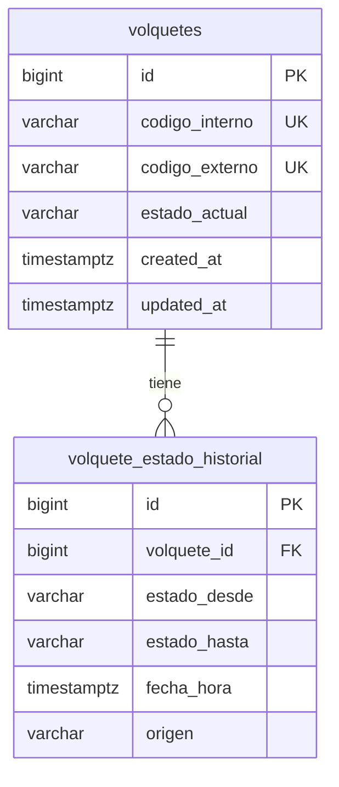

# Arquitectura — Inventario de Volquetes (T1 + T2)

**Rol:** Agente 4 — Architect (AFA SCL)  
**Feature:** Inventario de Volquetes (ABM + estados + QR externo)  
**Alcance del diseño:** T1 (modelo de datos) y T2 (API CRUD + listado por estado); contrato de transición de estado (T4) definido para implementación posterior.

**Fuentes consultadas:** memory-bank/00-project-overview.md, 01-architecture.md, 04-api-documentation.md, 06-data-model.md, general.mdc, AGENTS.md.

---

## 1) Resumen de arquitectura

- **T1:** Dos tablas en PostgreSQL: `volquetes` (identificación, códigos, estado actual) y `volquete_estado_historial` (cada cambio de estado con origen opcional). Scripts incrementales y rollback en `db/scripts/`.
- **T2:** Recurso REST `/api/volquetes` con CRUD completo y listado paginado con filtro por estado. DTOs request/response; sin exponer entidades JPA. Errores estándar 400/404/409/422.
- **Transición de estado (T4):** Contrato definido aquí: PATCH `/api/volquetes/{id}/estado` con cuerpo `{ estado, origen? }`; actualiza `volquetes.estado_actual` e inserta en `volquete_estado_historial`.
- Estados fijos: `DISPONIBLE`, `EN_CLIENTE`, `EN_TRANSITO`, `FUERA_DE_SERVICIO`. QR se genera en UI desde `codigoExterno`; no se persiste en backend.
- No se inventan permisos ni workflows nuevos; reutilizar convención de permisos existente (ej. admin para ABM).

---

## 2) Modelo de datos

### 2.1) Tabla `volquetes`

| Campo             | Tipo           | Restricciones |
|-------------------|----------------|---------------|
| `id`              | BIGINT         | PK, GENERATED BY DEFAULT AS IDENTITY |
| `codigo_interno`  | VARCHAR(50)    | NOT NULL, UNIQUE |
| `codigo_externo`  | VARCHAR(50)    | NOT NULL, UNIQUE |
| `estado_actual`   | VARCHAR(20)    | NOT NULL |
| `created_at`      | TIMESTAMPTZ    | DEFAULT now() (opcional, alineado a clientes) |
| `updated_at`      | TIMESTAMPTZ    | DEFAULT now() (opcional) |

- **PK:** `id`
- **FKs:** ninguna
- **Constraints:**
  - `chk_volquetes_estado_actual` — CHECK (`estado_actual` IN ('DISPONIBLE', 'EN_CLIENTE', 'EN_TRANSITO', 'FUERA_DE_SERVICIO'))
  - `uk_volquetes_codigo_interno` — UNIQUE (`codigo_interno`)
  - `uk_volquetes_codigo_externo` — UNIQUE (`codigo_externo`)
- **Índices:**
  - `idx_volquetes_estado_actual` — para listado/filtro por estado
  - `idx_volquetes_codigo_interno` — búsqueda por código interno (opcional si UNIQUE ya crea índice)
  - `idx_volquetes_codigo_externo` — búsqueda por código externo (idem)

En PostgreSQL, UNIQUE implica índice; los índices explícitos `idx_volquetes_codigo_*` son opcionales si se desea nombre controlado; en tal caso se puede usar UNIQUE con nombre y prescindir de índice adicional.

---

### 2.2) Tabla `volquete_estado_historial`

Registra cada cambio de estado para auditoría y consultas. Una fila por transición.

| Campo          | Tipo        | Restricciones |
|----------------|-------------|---------------|
| `id`           | BIGINT      | PK, GENERATED BY DEFAULT AS IDENTITY |
| `volquete_id`  | BIGINT      | NOT NULL, FK → volquetes(id) |
| `estado_desde` | VARCHAR(20) | NOT NULL (estado anterior) |
| `estado_hasta` | VARCHAR(20) | NOT NULL (estado nuevo) |
| `fecha_hora`   | TIMESTAMPTZ | NOT NULL, DEFAULT now() |
| `origen`       | VARCHAR(10) | NULLABLE; valores: `MANUAL`, `PEDIDO` |

- **PK:** `id`
- **FKs:** `volquete_id` → `volquetes(id)` (ON DELETE restrict o CASCADE según política; recomendado RESTRICT para no borrar historial si se borra volquete)
- **Constraints:**
  - `chk_volquete_historial_estado_desde` — CHECK (`estado_desde` IN ('DISPONIBLE', 'EN_CLIENTE', 'EN_TRANSITO', 'FUERA_DE_SERVICIO'))
  - `chk_volquete_historial_estado_hasta` — CHECK (`estado_hasta` IN ('DISPONIBLE', 'EN_CLIENTE', 'EN_TRANSITO', 'FUERA_DE_SERVICIO'))
  - `chk_volquete_historial_origen` — CHECK (`origen` IS NULL OR `origen` IN ('MANUAL', 'PEDIDO'))
- **Índices:**
  - `idx_volquete_estado_historial_volquete_id` — para listar historial por volquete y ordenar por `fecha_hora`

---

### 2.3) Convención de scripts (alineado a 06-data-model)

- Incremental: `YYYYMMDD_<issueId>_volquetes.sql` (crear `volquetes` y `volquete_estado_historial`).
- Rollback: `YYYYMMDD_<issueId>_volquetes__rollback.sql` (DROP TABLE en orden: primero `volquete_estado_historial`, luego `volquetes`).

---

## 3) Contrato API

Base: `<BASE_URL>`, `Content-Type: application/json`. Formato de error estándar según 04-api-documentation (code, message, details, timestamp).

### 3.1) Recurso: `/api/volquetes`

Permiso requerido: mismo criterio que clientes (admin para ABM; no inventar nuevos roles).

#### GET /api/volquetes

- **Descripción:** Listado paginado de volquetes con filtro opcional por estado.
- **Query params:** `page`, `size`, `sort` (estándar Pageable); `estado` (opcional): uno de `DISPONIBLE`, `EN_CLIENTE`, `EN_TRANSITO`, `FUERA_DE_SERVICIO`. Si se omite `estado`, se listan todos.
- **Response 200:**
```json
{
  "content": [
    {
      "id": 1,
      "codigoInterno": "string",
      "codigoExterno": "string",
      "estadoActual": "DISPONIBLE"
    }
  ],
  "totalElements": 0,
  "totalPages": 0,
  "size": 20,
  "number": 0
}
```
- **Errores:** 400 (parámetros inválidos, ej. estado no permitido), 401/403.

---

#### GET /api/volquetes/{id}

- **Descripción:** Detalle de un volquete por ID.
- **Response 200:**
```json
{
  "id": 1,
  "codigoInterno": "string",
  "codigoExterno": "string",
  "estadoActual": "DISPONIBLE"
}
```
- **Errores:** 401/403, 404 (volquete inexistente).

---

#### POST /api/volquetes

- **Descripción:** Crear volquete. Estado inicial definido en cuerpo; si se omite, se considera DISPONIBLE (definir en implementación).
- **Request:**
```json
{
  "codigoInterno": "string",
  "codigoExterno": "string",
  "estadoInicial": "DISPONIBLE"
}
```
- `codigoInterno`, `codigoExterno`: obligatorios, no vacíos. `estadoInicial`: opcional; si no se envía, valor por defecto DISPONIBLE.
- **Response 201:** Cuerpo igual que GET /api/volquetes/{id}; header `Location: /api/volquetes/{id}`.
- **Errores:** 400 (JSON malformado), 401/403, 409 (codigoInterno o codigoExterno ya existente), 422 (validación de negocio: campo vacío, estado inicial inválido).

---

#### PUT /api/volquetes/{id}

- **Descripción:** Actualizar volquete. Solo se permiten cambios de `codigoInterno` y `codigoExterno` (no cambiar estado por aquí; usar endpoint de transición).
- **Request:** mismo cuerpo que POST (codigoInterno, codigoExterno). Campo `estadoInicial` no aplica en PUT; si se envía, se ignora o se responde 400 según criterio del equipo (recomendación: ignorar para no romper cliente).
- **Response 200:** mismo cuerpo que GET /api/volquetes/{id}.
- **Errores:** 400, 401/403, 404, 409 (unicidad de código en otro registro), 422.

---

#### DELETE /api/volquetes/{id}

- **Descripción:** Eliminar volquete (hard delete). Si en el futuro existieran pedidos asociados, valorar 409 cuando corresponda (fuera de alcance T1/T2).
- **Response 204:** sin cuerpo.
- **Errores:** 401/403, 404. (409 si se define restricción por pedidos en el futuro.)

---

### 3.2) Transición de estado (implementación en T4; contrato aquí)

#### PATCH /api/volquetes/{id}/estado

- **Descripción:** Cambiar el estado actual del volquete. Actualiza `volquetes.estado_actual` e inserta un registro en `volquete_estado_historial`.
- **Request:**
```json
{
  "estado": "EN_CLIENTE",
  "origen": "MANUAL"
}
```
- `estado`: obligatorio; uno de `DISPONIBLE`, `EN_CLIENTE`, `EN_TRANSITO`, `FUERA_DE_SERVICIO`.
- `origen`: opcional; `MANUAL` | `PEDIDO`. Si se omite, persistir NULL en historial.
- **Response 200:** cuerpo igual que GET /api/volquetes/{id} (estado actualizado).
- **Errores:** 400 (estado/origen inválido), 401/403, 404 (volquete inexistente), 422 (transición no permitida por reglas de negocio; mensaje claro).

Reglas de transición (a definir en T4 en detalle): permitir cualquier transición entre los cuatro estados salvo que se documente restricción; EN_TRANSITO sin pedido es válido (origen MANUAL).

---

### 3.3) DTOs resumidos

| DTO                     | Uso              | Campos |
|-------------------------|------------------|--------|
| VolqueteRequest         | POST, PUT        | codigoInterno, codigoExterno; POST además estadoInicial (opcional) |
| VolqueteResponse        | GET by id, POST 201, PUT 200, PATCH 200 | id, codigoInterno, codigoExterno, estadoActual |
| VolqueteEstadoRequest   | PATCH /estado    | estado (required), origen (optional: MANUAL \| PEDIDO) |
| Page<VolqueteResponse>  | GET list         | content, totalElements, totalPages, size, number (estándar Spring) |

Nombres de campos en JSON: camelCase. En BD: snake_case.

---

### 3.4) Códigos de error esperados

| Código HTTP | Situación típica |
|-------------|------------------|
| 400         | Parámetros de query inválidos, JSON malformado, estado/origen con valor no permitido |
| 401         | No autenticado |
| 403         | Sin permiso |
| 404         | Volquete no encontrado (GET/PUT/DELETE/PATCH por id) |
| 409         | codigoInterno o codigoExterno duplicado (POST/PUT) |
| 422         | Validación de negocio (campo vacío, transición de estado no permitida) |
| 500         | Error interno (formato estándar de error) |

---

## 4) Decisiones arquitectónicas (ADR corto)

### ADR — Enum en aplicación, VARCHAR en base de datos

- **Decisión:** En PostgreSQL las columnas de estado (`estado_actual`, `estado_desde`, `estado_hasta`) y `origen` son VARCHAR con CHECK. En backend (Java) se usan enums (ej. `VolqueteEstado`, `OrigenEstado`).
- **Motivo:** Consistencia con tabla `clientes` (tipo COMUN/ABONO); evita dependencia de tipos ENUM nativos de Postgres entre entornos; facilita evolución de valores con script SQL (CHECK) y en código (enum).
- **Alternativas:** ENUM de PostgreSQL (menos portable, mismo criterio de evolución); solo VARCHAR sin enum en app (menos type-safety).
- **Impacto:** Scripts DDL, entidades JPA, DTOs y validaciones.

---

### ADR — Historial en tabla separada

- **Decisión:** Historial de cambios de estado en tabla `volquete_estado_historial`, no en columna JSON ni en misma tabla con filas de “eventos” mezclados con el registro actual del volquete.
- **Motivo:** Consultas simples por volquete y por rango de fechas; auditoría clara; no sobrecargar la tabla principal.
- **Alternativas:** JSONB en `volquetes` (menos cómodo para consultas y reportes); tabla de eventos genérica (sobreingeniería para v1).
- **Impacto:** T1 script, T4 servicio que escribe en historial.

---

### ADR — Estado actual denormalizado en `volquetes`

- **Decisión:** El estado “actual” se persiste en `volquetes.estado_actual` y se actualiza en cada transición; el historial es append-only (cada fila es “estado_desde → estado_hasta”).
- **Motivo:** Listados y filtros por estado sin derivar desde historial; rendimiento predecible. La “verdad” del estado actual para lectura es `volquetes.estado_actual`; el historial es la verdad para “quién cambió qué y cuándo”.
- **Alternativas:** Derivar estado actual como “última fila de historial” (más costoso en listados y requiere buen índice).
- **Trade-off:** Hay que mantener `estado_actual` y el historial sincronizados en la misma transacción (T4).
- **Impacto:** T1 modelo, T2 lectura, T4 escritura en ambas tablas en una transacción.

---

## 5) Archivos del memory-bank a actualizar (y sección)

| Archivo | Sección a actualizar | Contenido |
|---------|----------------------|-----------|
| **06-data-model.md** | Tras la sección de tabla `clientes` (y antes del bloque genérico `<tabla>`): añadir subsecciones **volquetes** y **volquete_estado_historial** con: PK, campos, FKs, constraints, índices; y referencia a scripts `YYYYMMDD_<issueId>_volquetes.sql` y `__rollback.sql`. | Modelo detallado de ambas tablas según §2 de este documento. |
| **04-api-documentation.md** | Después de la sección **Clientes**: añadir sección **Volquetes** con todos los endpoints (§3.1 y §3.2), DTOs de request/response y códigos de error. Reemplazar o eliminar el bloque genérico “<Nombre del recurso>” si queda obsoleto. | Contrato completo GET/POST/PUT/DELETE listado y por id; PATCH estado; ejemplos JSON y errores. |
| **01-architecture.md** | Sección “4) Decisiones / ADRs”: añadir entradas cortas (o referencia a este doc) para: enum vs VARCHAR, historial separado, estado actual denormalizado. | Resumen de las tres ADRs anteriores o link a este documento. |

No se modifican en este diseño: `00-project-overview.md` (ya describe inventario de volquetes), `07-frontend-guidelines.md` (sin cambio de convenciones).

---

## 6) Diagrama (Mermaid) — relación volquetes / historial



---

**Listo para que Builder Backend implemente T1 (scripts) y T2 (CRUD + listado por estado) y luego T4 (transición + historial) sin definir nuevos contratos ni modelos.**
