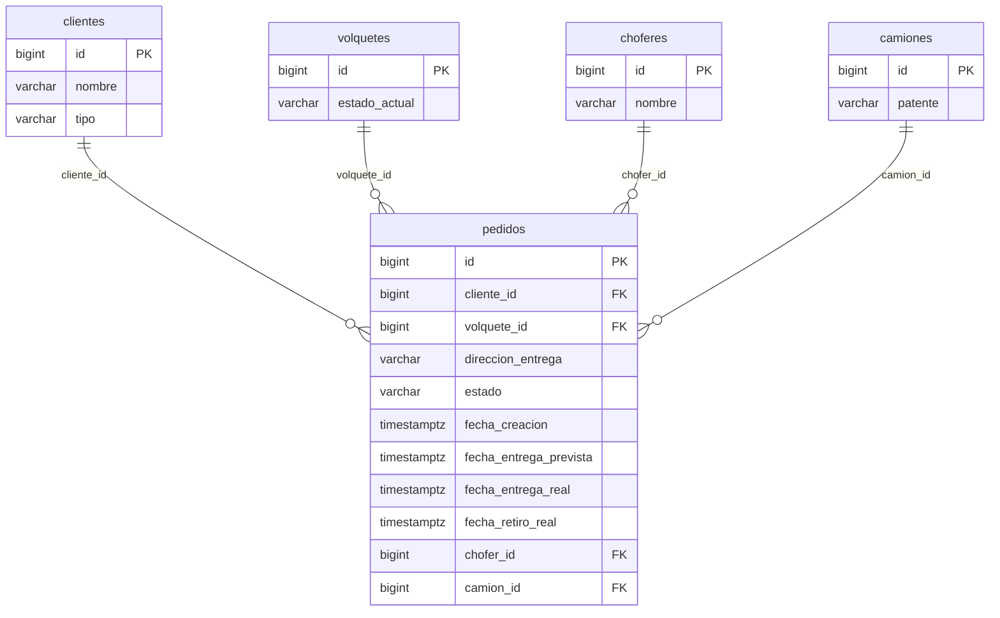
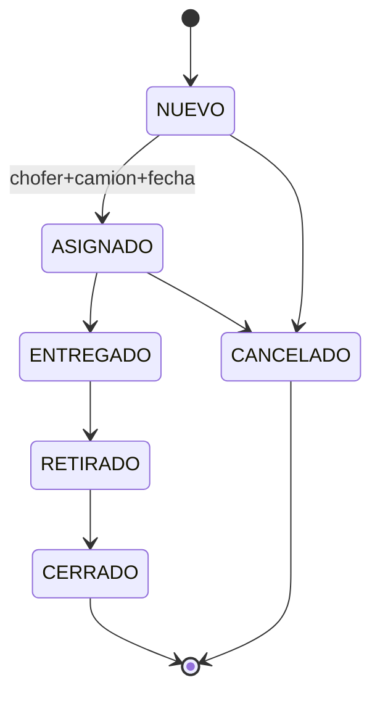

# Arquitectura — Issue 3: Gestión de Pedidos (T1–T5)

> Agente 4 — Architect. Fuente: memory-bank 00, 01, 04, 06, 07 + tech-plan Issue 3 + PRD refinado.  
> Sin código; solo diseño y contratos. Si falta información, se listan P0.

---

## 1) Resumen de arquitectura

- **Pedidos** se modelan como recurso propio con tabla `pedidos`, FK a `clientes`, `volquetes`, `choferes` y `camiones`. La modalidad de precio (común/abono) no se persiste en pedidos; se deriva del cliente.
- **Choferes** y **camiones** son tablas mínimas (id + identificador) para soportar el estado ASIGNADO; sin ABM completo en v1, solo datos para asignación y selectores.
- **Unicidad de volquete activo:** un mismo `volquete_id` no puede estar en más de un pedido con estado NUEVO, ASIGNADO o ENTREGADO; se garantiza con índice único parcial en PostgreSQL.
- **Transiciones de estado** se implementan en backend (T3) vía `PATCH /api/pedidos/{id}/estado`; al pasar a ENTREGADO/RETIRADO/CANCELADO se actualiza `volquetes.estado_actual` y se inserta en `volquete_estado_historial` con origen PEDIDO, en la misma transacción.
- **Permisos:** Admin puede crear/editar pedidos (POST, PUT) y cambiar estado (PATCH); Chofer solo puede listar/detalle (GET) y cambiar estado (PATCH). Sin DELETE físico de pedidos; solo cancelación (estado CANCELADO).
- **Frontend:** una vista principal de pedidos (listado + detalle); alta/edición con formularios que consumen selectores (clientes, volquetes, choferes, camiones). Cambio de estado (T5) integrado en la misma vista con formulario de asignación para ASIGNADO.
- **Contrato API** alineado con convenciones existentes: plural `/api/pedidos`, DTOs request/response, códigos 400/404/409/422 y formato de error estándar.
- **Seguridad y observabilidad:** permisos por rol (Admin/Chofer) documentados por endpoint; logs mínimos en operaciones de escritura (crear pedido, cambiar estado) sin datos sensibles.

---

## 2) Modelo de datos (PostgreSQL 16+)

### Tabla `choferes`

- **PK:** `id` (BIGINT GENERATED BY DEFAULT AS IDENTITY)
- **Campos:**
  - `id` — BIGINT, PK
  - `nombre` — VARCHAR(255), NOT NULL (identificador del chofer para listados/selector)
  - *(opcional)* `created_at` — TIMESTAMPTZ, default now()
- **FKs:** ninguna
- **Constraints:** ninguno adicional
- **Índices:** ninguno obligatorio (tabla catálogo pequeña en v1)
- **Nota:** En v1 no hay ABM; datos cargados por script o futura pantalla. El selector devuelve id + nombre.

### Tabla `camiones`

- **PK:** `id` (BIGINT GENERATED BY DEFAULT AS IDENTITY)
- **Campos:**
  - `id` — BIGINT, PK
  - `patente` — VARCHAR(20), NOT NULL (identificador para listados/selector; puede ser patente o nombre según negocio)
  - *(opcional)* `created_at` — TIMESTAMPTZ, default now()
- **FKs:** ninguna
- **Constraints:** ninguno adicional
- **Índices:** ninguno obligatorio en v1
- **Nota:** Mismo criterio que choferes; selector id + patente (o nombre si se renombra el campo).

### Tabla `pedidos`

- **PK:** `id` (BIGINT GENERATED BY DEFAULT AS IDENTITY)
- **Campos:**
  - `id` — BIGINT, PK
  - `cliente_id` — BIGINT, NOT NULL, FK → clientes(id)
  - `volquete_id` — BIGINT, NOT NULL, FK → volquetes(id)
  - `direccion_entrega` — VARCHAR(500), NOT NULL (puede ser distinta a la del cliente)
  - `estado` — VARCHAR(20), NOT NULL
  - `fecha_creacion` — TIMESTAMPTZ, NOT NULL, default now()
  - `fecha_entrega_prevista` — TIMESTAMPTZ, nullable
  - `fecha_entrega_real` — TIMESTAMPTZ, nullable
  - `fecha_retiro_real` — TIMESTAMPTZ, nullable
  - `chofer_id` — BIGINT, nullable, FK → choferes(id)
  - `camion_id` — BIGINT, nullable, FK → camiones(id)
  - *(opcional)* `created_at` — TIMESTAMPTZ, default now()
  - *(opcional)* `updated_at` — TIMESTAMPTZ, default now()
- **FKs:**
  - `cliente_id` → clientes(id) ON DELETE RESTRICT
  - `volquete_id` → volquetes(id) ON DELETE RESTRICT
  - `chofer_id` → choferes(id) ON DELETE SET NULL (o RESTRICT según política)
  - `camion_id` → camiones(id) ON DELETE SET NULL (o RESTRICT según política)
- **Constraints:**
  - `chk_pedidos_estado` — CHECK (`estado` IN ('NUEVO', 'ASIGNADO', 'ENTREGADO', 'RETIRADO', 'CERRADO', 'CANCELADO'))
- **Índices:**
  - `idx_pedidos_estado` — listado/filtro por estado
  - `idx_pedidos_cliente_id` — listado/filtro por cliente
  - `idx_pedidos_volquete_id` — listado/filtro y soporte del unique parcial
  - **Índice único parcial (unicidad volquete activo):**  
    `uk_pedidos_volquete_activo` — UNIQUE (`volquete_id`) WHERE `estado` IN ('NUEVO', 'ASIGNADO', 'ENTREGADO')
- **Nota:** `direccion_entrega` NOT NULL según PRD (dirección de entrega puede ser otra; se exige que esté informada). Si negocio acepta “usar dirección del cliente” sin campo explícito, podría ser nullable y derivarse en app; por defecto se deja NOT NULL.

### Scripts SQL sugeridos

- **Incremental:** `db/scripts/YYYYMMDD_3_pedidos.sql`  
  Orden sugerido: CREATE TABLE choferes; CREATE TABLE camiones; CREATE TABLE pedidos (con FKs, CHECK, índices y unique parcial).
- **Rollback:** `db/scripts/YYYYMMDD_3_pedidos__rollback.sql`  
  Orden: DROP TABLE pedidos; DROP TABLE camiones; DROP TABLE choferes (respetar FKs: pedidos referencia a las otras dos).

### P0 si aplica

- **P0 — Dirección de entrega nullable:** Si negocio confirma que puede quedar vacía y tomarse de cliente en UI, cambiar `direccion_entrega` a nullable en script y contrato.

---

## 3) Contrato API

### Recurso base

- **Pedidos:** `/api/pedidos` (plural). Content-Type `application/json`. Auth: Bearer token. Permisos por endpoint más abajo.

### Endpoints pedidos

| Método | Path | Descripción | Permiso |
|--------|------|-------------|--------|
| GET | /api/pedidos | Listado paginado con filtros (estado, clienteId, volqueteId) | Admin, Chofer |
| GET | /api/pedidos/{id} | Detalle de un pedido | Admin, Chofer |
| POST | /api/pedidos | Crear pedido (estado inicial NUEVO) | Admin |
| PUT | /api/pedidos/{id} | Actualizar pedido (campos editables) | Admin |
| PATCH | /api/pedidos/{id}/estado | Cambiar estado (y datos de asignación si destino ASIGNADO) | Admin, Chofer |

**GET /api/pedidos**  
- Query params: `page`, `size`, `sort` (Pageable); `estado` (opcional): NUEVO | ASIGNADO | ENTREGADO | RETIRADO | CERRADO | CANCELADO; `clienteId` (opcional); `volqueteId` (opcional).  
- Response 200: `Page<PedidoResponse>` (content, totalElements, totalPages, size, number).  
- Errores: 400 (params inválidos), 401, 403.

**GET /api/pedidos/{id}**  
- Response 200: cuerpo completo PedidoResponse (incluye cliente/volquete/chofer/camión para detalle).  
- Errores: 401, 403, 404.

**POST /api/pedidos**  
- Request: PedidoRequest (clienteId, volqueteId, direccionEntrega, fechaEntregaPrevista opcional).  
- Response 201: PedidoResponse (Location: /api/pedidos/{id}).  
- Errores: 400 (JSON/validación Bean), 401, 403, 404 (cliente o volquete inexistente), 409 (volquete ya en pedido activo), 422 (cliente/volquete faltante u otra regla).

**PUT /api/pedidos/{id}**  
- Request: PedidoRequest (mismos campos editables: clienteId, volqueteId, direccionEntrega, fechaEntregaPrevista; y los que se definan editables en T2).  
- Response 200: PedidoResponse.  
- Errores: 400, 401, 403, 404, 409 (si al cambiar volquete ya está en otro activo), 422.

**PATCH /api/pedidos/{id}/estado**  
- Request: PedidoEstadoRequest (estado obligatorio; para destino ASIGNADO: choferId, camionId, fechaEntregaPrevista obligatorios).  
- Response 200: PedidoResponse (estado y datos actualizados).  
- Errores: 400 (estado inválido), 401, 403, 404, 422 (transición no permitida, datos faltantes para ASIGNADO, pedido ya CERRADO/CANCELADO).

### Endpoints choferes y camiones (selectores)

| Método | Path | Descripción | Permiso |
|--------|------|-------------|--------|
| GET | /api/choferes/selector | Lista liviana para combo (id, nombre) | Admin, Chofer |
| GET | /api/camiones/selector | Lista liviana para combo (id, patente) | Admin, Chofer |

- Response 200: array de `{ "id": number, "nombre": string }` (choferes) y `{ "id": number, "patente": string }` (camiones).  
- Errores: 401, 403.

### DTOs (nombres y campos)

- **PedidoRequest:** clienteId (Long), volqueteId (Long), direccionEntrega (String), fechaEntregaPrevista (Instant o ISO-8601 nullable). Para PUT se envían los campos editables; el backend no acepta estado ni chofer/camión por este DTO.
- **PedidoResponse:** id, clienteId, volqueteId, direccionEntrega, estado, fechaCreacion, fechaEntregaPrevista, fechaEntregaReal, fechaRetiroReal, choferId, camionId; opcionalmente clienteNombre, volqueteCodigoInterno (o resumen) y choferNombre, camionPatente para detalle sin N+1.
- **PedidoEstadoRequest:** estado (String, uno de NUEVO|ASIGNADO|…|CANCELADO); choferId (Long, opcional salvo para ASIGNADO); camionId (Long, opcional salvo para ASIGNADO); fechaEntregaPrevista (Instant, opcional salvo para ASIGNADO).
- **Listado:** Page estándar (content: PedidoResponse[], totalElements, totalPages, size, number).
- **Selector chofer:** { id, nombre }.
- **Selector camión:** { id, patente }.

### Códigos de error

- **400:** Parámetros de query o JSON malformados, estado inválido en filtro o body.  
- **401:** No autenticado.  
- **403:** Sin permiso (ej. Chofer en POST/PUT pedidos).  
- **404:** Pedido, cliente, volquete, chofer o camión no encontrado.  
- **409:** Volquete ya asociado a otro pedido activo (crear o editar).  
- **422:** Regla de negocio (cliente/volquete obligatorio, transición no permitida, datos faltantes para ASIGNADO, pedido cerrado/cancelado).  
- **500:** Error interno. Formato de error según 04 (code, message, details, timestamp).

---

## 4) Reglas de negocio (validación en Service)

- **Crear pedido (POST):** Cliente existe; volquete existe; volquete no está en otro pedido con estado NUEVO, ASIGNADO o ENTREGADO; direccionEntrega no vacía (si se exige en contrato). Si falla existencia → 404; si falla unicidad activo → 409; si faltan datos obligatorios → 422.
- **Actualizar pedido (PUT):** Pedido existe; si se cambia volquete, el nuevo no debe estar en otro pedido activo (excluyendo el propio pedido); cliente existe si se cambia. 404/409/422 según caso.
- **Cambiar estado (PATCH):**  
  - Transiciones permitidas: NUEVO → ASIGNADO (con choferId, camionId, fechaEntregaPrevista) o CANCELADO; ASIGNADO → ENTREGADO o CANCELADO; ENTREGADO → RETIRADO; RETIRADO → CERRADO. CERRADO y CANCELADO no admiten más transiciones.  
  - Para ASIGNADO: choferId, camionId y fechaEntregaPrevista obligatorios; chofer y camión deben existir.  
  - Si transición no permitida o datos faltantes → 422.  
  - Efectos secundarios (misma transacción): ENTREGADO → volquete a EN_CLIENTE + historial PEDIDO; RETIRADO → volquete a DISPONIBLE + historial PEDIDO; CANCELADO → volquete a DISPONIBLE + historial PEDIDO.
- **Listado/filtros:** Solo aplicar filtros presentes; paginación estándar. Sin reglas de negocio adicionales.
- **Eliminación:** No hay DELETE de pedidos; solo estado CANCELADO. DELETE cliente/volquete: 409 si existen pedidos (o pedidos activos para volquete) según ya documentado en 04/06.

---

## 5) Seguridad mínima

- **Roles considerados:** Admin, Chofer (alineado con 00 y PRD).  
- **Admin:** acceso a POST/PUT pedidos, GET list/detalle, PATCH estado; GET selectores choferes/camiones.  
- **Chofer:** acceso a GET list/detalle pedidos, PATCH estado, GET selectores; sin acceso a POST/PUT pedidos (403 si intenta).  
- **Implementación:** cuando exista auth en el backend (01 indica “PENDIENTE”), restringir por rol en cada endpoint; documentar en 04 el permiso requerido (ej. “Admin” para POST/PUT, “Admin o Chofer” para GET y PATCH estado).  
- No loguear datos sensibles; no exponer en respuestas más de lo definido en el contrato.

---

## 6) Observabilidad mínima

- Logs en operaciones de escritura: creación de pedido, actualización de pedido, cambio de estado (nivel INFO o equivalente), con identificador de pedido (id) y estado destino; sin datos personales ni direcciones completas en log.  
- Errores de validación o negocio (409, 422): log nivel WARN con código/mensaje, sin stack si es regla de negocio esperada.  
- No se exige en v1: métricas específicas ni trazabilidad distribuida.

---

## 7) ADRs cortos

### ADR-005 — Pedidos: estados en VARCHAR + CHECK (consistencia con volquetes)

- **Decisión:** Estado de pedido en columna `estado` VARCHAR con CHECK (NUEVO, ASIGNADO, ENTREGADO, RETIRADO, CERRADO, CANCELADO). En aplicación se usan enums.
- **Motivo:** Consistencia con ADR-002 (volquetes y historial); evolución vía script y código sin depender de ENUM nativo PostgreSQL.
- **Trade-off:** Sin type-safety en DB; validación en app y CHECK en DB.

### ADR-006 — Unicidad volquete activo con índice único parcial

- **Decisión:** Garantizar “un volquete solo en un pedido activo” con UNIQUE (`volquete_id`) WHERE `estado` IN ('NUEVO','ASIGNADO','ENTREGADO').
- **Motivo:** Evitar doble asignación en DB y en aplicación; consultas de “volquete libre” simples.
- **Alternativas:** Solo validación en Service (riesgo de concurrencia); trigger (más complejidad).
- **Trade-off:** No se puede tener dos pedidos activos con el mismo volquete ni por error ni por race condition.

### ADR-007 — Chofer y camión como tablas catálogo mínimas (v1)

- **Decisión:** Tablas `choferes` y `camiones` con estructura mínima (id + nombre/patente); sin ABM en v1; solo selectores para asignación.
- **Motivo:** Cubrir estado ASIGNADO sin retrasar el MVP; ABM de choferes/camiones puede ser otro Issue.
- **Trade-off:** Datos cargados manualmente o por script hasta que exista pantalla.

### ADR-008 — Transiciones de pedido y estado de volquete en la misma transacción

- **Decisión:** Al cambiar pedido a ENTREGADO, RETIRADO o CANCELADO, la actualización de `volquetes.estado_actual` y la inserción en `volquete_estado_historial` (origen PEDIDO) se ejecutan en la misma transacción que el update del pedido.
- **Motivo:** Consistencia entre dominio pedidos e inventario; sin estados intermedios visibles.
- **Trade-off:** Service de pedidos depende de lógica (o servicio) de actualización de volquete/historial.

---

## 8) Diagramas Mermaid

### ERD (relación pedidos con clientes, volquetes, choferes, camiones)

### Máquina de estados del pedido

---

## 9) Actualizaciones en memory-bank

- **06-data-model.md:** Añadir secciones para tablas `choferes`, `camiones` y `pedidos` (PK, campos, FKs, constraints, índices, nombre del unique parcial y scripts sugeridos). Opcional: actualizar ERD si se mantiene un diagrama global en 06.
- **04-api-documentation.md:** Añadir sección “Pedidos” con todos los endpoints (GET list, GET id, POST, PUT, PATCH estado), query params, request/response y DTOs; sección “Choferes” y “Camiones” con GET selector. Documentar códigos 400/404/409/422 para pedidos y permiso por endpoint (Admin vs Chofer). Actualizar nota de DELETE cliente (409 si tiene pedidos) y DELETE volquete (409 si tiene pedido activo).
- **01-architecture.md:** Añadir ADR-005 a ADR-008 en la sección de decisiones; en “Seguridad”, cuando se implemente auth, indicar que pedidos y selectores restringen por rol Admin/Chofer según 04.

---

**P0 abiertas (si aplican)**  
- Ninguna bloqueante con el PRD refinado actual. Si se confirma que `direccion_entrega` puede ser nullable y tomarse de cliente en UI, ajustar modelo y contrato en una sola pasada.
