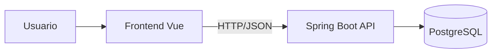

# 01 — Architecture (Arquitectura y decisiones)

> Objetivo: registrar decisiones técnicas que afectan al sistema y evitar re-discusiones.

## 1) Stack (base)
- Backend: Spring Boot 3 + Java 21 + Maven (sin migrador DB; scripts versionados en `db/scripts/`)
- DB: PostgreSQL 16+
- Frontend: Vue 3 + TypeScript + Pinia + Tailwind
- Deploy: manual

## 2) Diagrama alto nivel

## 3) Convenciones de arquitectura
### Backend
- Capas: Controller → Service → Repository
- DTOs request/response (no exponer entidades JPA)
- Errores consistentes vía @ControllerAdvice

### Frontend
- Composition API + TS por defecto
- API client centralizado
- Pinia solo para estado compartido
- Tailwind utility-first

## 4) Decisiones / ADRs (registro)
> Formato recomendado para cada decisión:
- **Fecha:** YYYY-MM-DD
- **Decisión:** <qué se decidió>
- **Motivo:** <por qué>
- **Alternativas consideradas:** <A/B/C>
- **Trade-offs:** <costos>
- **Impacto:** <qué módulos toca>

### ADR-001 — Backend: Spring Boot 3, Java 21, Maven, sin migrador DB
- Fecha: 2026-02-01
- Decisión: Backend Spring Boot 3 + Java 21 + Maven; sin Flyway/Liquibase; scripts SQL incrementales y rollback manual en `db/scripts/`.
- Motivo: Alineado con estándar AFA SCL (AGENTS.md); control explícito de cambios de esquema; trazabilidad en nombres de scripts.
- Alternativas: Flyway/Liquibase (descartado por decisión de equipo); Gradle (Maven elegido por preferencia/consistencia).
- Trade-offs: Ejecución manual de scripts en cada entorno; sin historial automático de migraciones en app.
- Impacto: Módulo `backend/`; documentación en `memory-bank/06-data-model.md`; scripts en `db/scripts/`.
