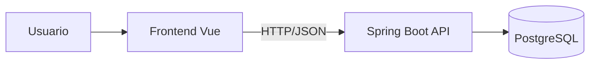

# 01 — Architecture (Arquitectura y decisiones)

> Objetivo: registrar decisiones técnicas que afectan al sistema y evitar re-discusiones.

## 1) Stack (base)
- Backend: Spring Boot 3 + Java 21 + Maven (sin migrador DB; scripts versionados en `db/scripts/`)
- DB: PostgreSQL 16+
- Frontend: Vue 3 + TypeScript + Pinia + Tailwind
- Deploy: manual

## 2) Diagrama alto nivel

## 3) Convenciones de arquitectura
### Backend
- Capas: Controller → Service → Repository
- DTOs request/response (no exponer entidades JPA)
- Errores consistentes vía @ControllerAdvice
- **Seguridad:** PENDIENTE — auth/authz no implementado; endpoints abiertos. Cuando se implemente: restringir por rol según memory-bank/04 (Admin para ABM; Admin o Chofer para pedidos según endpoint: POST/PUT solo Admin, GET y PATCH estado Admin o Chofer).

### Frontend
- Composition API + TS por defecto
- API client centralizado
- Pinia solo para estado compartido
- Tailwind utility-first

## 4) Decisiones / ADRs (registro)
> Formato recomendado para cada decisión:
- **Fecha:** YYYY-MM-DD
- **Decisión:** <qué se decidió>
- **Motivo:** <por qué>
- **Alternativas consideradas:** <A/B/C>
- **Trade-offs:** <costos>
- **Impacto:** <qué módulos toca>

### ADR-001 — Backend: Spring Boot 3, Java 21, Maven, sin migrador DB
- Fecha: 2026-02-01
- Decisión: Backend Spring Boot 3 + Java 21 + Maven; sin Flyway/Liquibase; scripts SQL incrementales y rollback manual en `db/scripts/`.
- Motivo: Alineado con estándar AFA SCL (AGENTS.md); control explícito de cambios de esquema; trazabilidad en nombres de scripts.
- Alternativas: Flyway/Liquibase (descartado por decisión de equipo); Gradle (Maven elegido por preferencia/consistencia).
- Trade-offs: Ejecución manual de scripts en cada entorno; sin historial automático de migraciones en app.
- Impacto: Módulo `backend/`; documentación en `memory-bank/06-data-model.md`; scripts en `db/scripts/`.

### ADR-002 — Volquetes: estados y origen en VARCHAR + CHECK (no ENUM nativo)
- Fecha: 2026-02-03
- Decisión: En PostgreSQL las columnas de estado (estado_actual, estado_desde, estado_hasta) y origen en volquetes/volquete_estado_historial son VARCHAR con CHECK. En backend (Java) se usan enums.
- Motivo: Consistencia con tabla clientes (tipo COMUN/ABONO); evita dependencia de ENUM nativos entre entornos; facilita evolución con script SQL y en código.
- Alternativas: ENUM de PostgreSQL (menos portable); solo VARCHAR sin enum en app (menos type-safety).
- Impacto: Scripts DDL volquetes/historial, entidades JPA, DTOs y validaciones.

### ADR-003 — Historial de estado de volquete en tabla separada
- Fecha: 2026-02-03
- Decisión: Historial de cambios de estado en tabla `volquete_estado_historial`, no en columna JSON ni en la misma tabla que el registro actual del volquete.
- Motivo: Consultas simples por volquete y por rango de fechas; auditoría clara; no sobrecargar la tabla principal.
- Alternativas: JSONB en volquetes; tabla de eventos genérica (sobreingeniería en v1).
- Impacto: T1 script, T4 servicio que escribe en historial.

### ADR-004 — Estado actual denormalizado en volquetes
- Fecha: 2026-02-03
- Decisión: El estado actual se persiste en `volquetes.estado_actual` y se actualiza en cada transición; el historial es append-only (estado_desde → estado_hasta). Sincronización en la misma transacción.
- Motivo: Listados y filtros por estado sin derivar desde historial; rendimiento predecible. Lectura de estado actual desde volquetes; historial para auditoría.
- Alternativas: Derivar estado actual como última fila de historial (más costoso en listados).
- Trade-offs: Mantener estado_actual e historial sincronizados en cada transición (T4).
- Impacto: T1 modelo, T2 lectura, T4 escritura en ambas tablas en una transacción.

### ADR-005 — Pedidos: estado en VARCHAR + CHECK
- Fecha: 2026-02-01
- Decisión: Estado de pedido en columna `estado` VARCHAR con CHECK (NUEVO, ASIGNADO, ENTREGADO, RETIRADO, CERRADO, CANCELADO). En aplicación se usan enums.
- Motivo: Consistencia con ADR-002 (volquetes); evolución vía script y código sin ENUM nativo PostgreSQL.
- Impacto: Script DDL pedidos, entidades JPA, DTOs y validaciones.

### ADR-006 — Unicidad volquete activo con índice único parcial
- Fecha: 2026-02-01
- Decisión: Garantizar “un volquete solo en un pedido activo” con UNIQUE (`volquete_id`) WHERE `estado` IN ('NUEVO','ASIGNADO','ENTREGADO') en tabla pedidos.
- Motivo: Evitar doble asignación en DB y en aplicación; consultas de volquete libre simples.
- Alternativas: Solo validación en Service (riesgo concurrencia); trigger (más complejidad).
- Trade-offs: No se puede tener dos pedidos activos con el mismo volquete.
- Impacto: Script pedidos (índice uk_pedidos_volquete_activo), Service validación.

### ADR-007 — Chofer y camión como tablas catálogo mínimas (v1)
- Fecha: 2026-02-01
- Decisión: Tablas `choferes` y `camiones` con estructura mínima (id + nombre/patente); sin ABM en v1; solo selectores para asignación.
- Motivo: Cubrir estado ASIGNADO sin retrasar MVP; ABM puede ser otro Issue.
- Trade-offs: Datos cargados por script o manualmente hasta que exista pantalla.
- Impacto: Script pedidos, endpoints GET /api/choferes/selector, GET /api/camiones/selector.

### ADR-008 — Transiciones de pedido y estado de volquete en la misma transacción
- Fecha: 2026-02-01
- Decisión: Al cambiar pedido a ENTREGADO, RETIRADO o CANCELADO, la actualización de `volquetes.estado_actual` y la inserción en `volquete_estado_historial` (origen PEDIDO) se ejecutan en la misma transacción que el update del pedido.
- Motivo: Consistencia entre dominio pedidos e inventario; sin estados intermedios visibles.
- Trade-offs: Service de pedidos depende de lógica/servicio de actualización de volquete/historial.
- Impacto: Backend T3 (transiciones de estado de pedidos).
