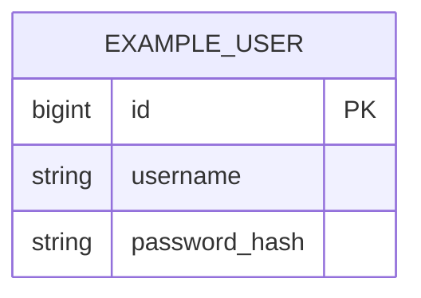

# 06 — Data Model (Modelo de datos)

> Objetivo: describir el modelo Postgres (tablas clave + constraints + índices) y cómo versionamos scripts.

## 1) Convenciones de scripts SQL (sin migrador)
- Ubicación: `<carpeta scripts>`
- Naming sugerido:
  - `YYYYMMDD_<issueId>_<descripcion>.sql`
  - `YYYYMMDD_<issueId>_<descripcion>__rollback.sql`
- Cada cambio DB debe incluir:
  - Script incremental
  - Rollback manual (best-effort)

## 2) Tablas principales

### clientes

Tabla de clientes para asociar a pedidos. Solo campos definidos: nombre/razón social, teléfono, email, dirección principal, tipo (común/abono). Código interno/externo no aplica.

- **PK:** `id` (BIGSERIAL / BIGINT GENERATED BY DEFAULT AS IDENTITY)
- **Campos:**
  - `id` — BIGINT, PK
  - `nombre` — VARCHAR(255), NOT NULL (nombre o razón social)
  - `telefono` — VARCHAR(50), nullable
  - `email` — VARCHAR(255), nullable
  - `direccion_principal` — VARCHAR(500), nullable
  - `tipo` — VARCHAR(10), NOT NULL, valores: `COMUN` | `ABONO`
  - *(opcional / supuesto)* `created_at` — TIMESTAMPTZ, default now()
  - *(opcional / supuesto)* `updated_at` — TIMESTAMPTZ, default now()
- **FKs:** ninguna (pedidos referenciará clientes cuando exista el recurso pedidos).
- **Índices:**
  - `idx_clientes_nombre` — búsqueda/listado por nombre
  - `idx_clientes_tipo` — filtro por tipo (común/abono) si se usa
- **Constraints:**
  - `chk_clientes_tipo` — CHECK (tipo IN ('COMUN', 'ABONO'))
  - `nombre` NOT NULL (validación mínima: no vacío; en app también)

Scripts: incremental `YYYYMMDD_<issueId>_clientes.sql`; rollback manual `YYYYMMDD_<issueId>_clientes__rollback.sql`.

---

### volquetes

Tabla de volquetes del inventario. Identificación por código interno y código externo (QR); estado actual para listados y filtros. Estados: DISPONIBLE, EN_CLIENTE, EN_TRANSITO, FUERA_DE_SERVICIO.

- **PK:** `id` (BIGINT GENERATED BY DEFAULT AS IDENTITY)
- **Campos:**
  - `id` — BIGINT, PK
  - `codigo_interno` — VARCHAR(50), NOT NULL, UNIQUE
  - `codigo_externo` — VARCHAR(50), NOT NULL, UNIQUE
  - `estado_actual` — VARCHAR(20), NOT NULL
  - `created_at` — TIMESTAMPTZ, default now() (opcional)
  - `updated_at` — TIMESTAMPTZ, default now() (opcional)
- **FKs:** ninguna
- **Constraints:**
  - `chk_volquetes_estado_actual` — CHECK (`estado_actual` IN ('DISPONIBLE', 'EN_CLIENTE', 'EN_TRANSITO', 'FUERA_DE_SERVICIO'))
  - `uk_volquetes_codigo_interno` — UNIQUE (`codigo_interno`)
  - `uk_volquetes_codigo_externo` — UNIQUE (`codigo_externo`)
- **Índices:**
  - `idx_volquetes_estado_actual` — listado/filtro por estado
  - (UNIQUE ya crea índice sobre codigo_interno y codigo_externo; índices con nombre explícito opcionales)

Scripts: incremental `YYYYMMDD_<issueId>_volquetes.sql`; rollback manual `YYYYMMDD_<issueId>_volquetes__rollback.sql` (DROP en orden: primero `volquete_estado_historial`, luego `volquetes`).

---

### volquete_estado_historial

Registra cada cambio de estado de un volquete para auditoría y consultas. Una fila por transición.

- **PK:** `id` (BIGINT GENERATED BY DEFAULT AS IDENTITY)
- **Campos:**
  - `id` — BIGINT, PK
  - `volquete_id` — BIGINT, NOT NULL, FK → volquetes(id)
  - `estado_desde` — VARCHAR(20), NOT NULL (estado anterior)
  - `estado_hasta` — VARCHAR(20), NOT NULL (estado nuevo)
  - `fecha_hora` — TIMESTAMPTZ, NOT NULL, default now()
  - `origen` — VARCHAR(10), nullable; valores: `MANUAL`, `PEDIDO`
- **FKs:** `volquete_id` → volquetes(id); ON DELETE RESTRICT recomendado
- **Constraints:**
  - `chk_volquete_historial_estado_desde` — CHECK (`estado_desde` IN ('DISPONIBLE', 'EN_CLIENTE', 'EN_TRANSITO', 'FUERA_DE_SERVICIO'))
  - `chk_volquete_historial_estado_hasta` — CHECK (`estado_hasta` IN ('DISPONIBLE', 'EN_CLIENTE', 'EN_TRANSITO', 'FUERA_DE_SERVICIO'))
  - `chk_volquete_historial_origen` — CHECK (`origen` IS NULL OR `origen` IN ('MANUAL', 'PEDIDO'))
- **Índices:**
  - `idx_volquete_estado_historial_volquete_id` — listar historial por volquete y ordenar por fecha_hora

Scripts: creadas junto con `volquetes` en el mismo incremental; rollback en el mismo archivo __rollback (orden: historial antes que volquetes).

---

### choferes

Catálogo mínimo para asignación de pedidos (estado ASIGNADO). En v1 sin ABM; solo datos para selector.

- **PK:** `id` (BIGINT GENERATED BY DEFAULT AS IDENTITY)
- **Campos:**
  - `id` — BIGINT, PK
  - `nombre` — VARCHAR(255), NOT NULL (identificador para listados/selector)
  - *(opcional)* `created_at` — TIMESTAMPTZ, default now()
- **FKs:** ninguna
- **Constraints:** ninguno adicional
- **Índices:** ninguno obligatorio en v1

Scripts: incluidos en `20260204_3_pedidos.sql`; rollback en `20260204_3_pedidos__rollback.sql` (DROP después de pedidos).

---

### camiones

Catálogo mínimo para asignación de pedidos (estado ASIGNADO). En v1 sin ABM; solo datos para selector.

- **PK:** `id` (BIGINT GENERATED BY DEFAULT AS IDENTITY)
- **Campos:**
  - `id` — BIGINT, PK
  - `patente` — VARCHAR(20), NOT NULL (identificador para listados/selector)
  - *(opcional)* `created_at` — TIMESTAMPTZ, default now()
- **FKs:** ninguna
- **Constraints:** ninguno adicional
- **Índices:** ninguno obligatorio en v1

Scripts: incluidos en `20260204_3_pedidos.sql`; rollback en `20260204_3_pedidos__rollback.sql` (DROP después de pedidos).

---

### pedidos

Pedidos de servicio asociados a un cliente y un volquete. Dirección de entrega puede ser distinta a la del cliente. Estado con transiciones: NUEVO → ASIGNADO → ENTREGADO → RETIRADO → CERRADO; CANCELADO desde NUEVO o ASIGNADO. Un volquete no puede estar en más de un pedido activo (NUEVO, ASIGNADO, ENTREGADO).

- **PK:** `id` (BIGINT GENERATED BY DEFAULT AS IDENTITY)
- **Campos:**
  - `id` — BIGINT, PK
  - `cliente_id` — BIGINT, NOT NULL, FK → clientes(id)
  - `volquete_id` — BIGINT, NOT NULL, FK → volquetes(id)
  - `direccion_entrega` — VARCHAR(500), NOT NULL
  - `estado` — VARCHAR(20), NOT NULL
  - `fecha_creacion` — TIMESTAMPTZ, NOT NULL, default now()
  - `fecha_entrega_prevista` — TIMESTAMPTZ, nullable
  - `fecha_entrega_real` — TIMESTAMPTZ, nullable
  - `fecha_retiro_real` — TIMESTAMPTZ, nullable
  - `chofer_id` — BIGINT, nullable, FK → choferes(id)
  - `camion_id` — BIGINT, nullable, FK → camiones(id)
  - *(opcional)* `created_at` — TIMESTAMPTZ, default now()
  - *(opcional)* `updated_at` — TIMESTAMPTZ, default now()
- **FKs:**
  - `cliente_id` → clientes(id) ON DELETE RESTRICT
  - `volquete_id` → volquetes(id) ON DELETE RESTRICT
  - `chofer_id` → choferes(id) ON DELETE SET NULL (o RESTRICT según política)
  - `camion_id` → camiones(id) ON DELETE SET NULL (o RESTRICT según política)
- **Constraints:**
  - `chk_pedidos_estado` — CHECK (`estado` IN ('NUEVO', 'ASIGNADO', 'ENTREGADO', 'RETIRADO', 'CERRADO', 'CANCELADO'))
- **Índices:**
  - `idx_pedidos_estado` — listado/filtro por estado
  - `idx_pedidos_cliente_id` — listado/filtro por cliente
  - `idx_pedidos_volquete_id` — listado/filtro y soporte del unique parcial
  - `uk_pedidos_volquete_activo` — UNIQUE (`volquete_id`) WHERE `estado` IN ('NUEVO', 'ASIGNADO', 'ENTREGADO') — garantiza un volquete solo en un pedido activo

Scripts: incremental `20260204_3_pedidos.sql` (CREATE TABLE choferes, camiones, pedidos en ese orden); rollback `20260204_3_pedidos__rollback.sql` (DROP TABLE pedidos, camiones, choferes).

---

## 3) ERD (Mermaid) — opcional pero recomendado

## 4) Índices y performance
- Listar índices agregados y motivo (consulta que acelera).
- Evitar over-indexing.

## 5) scripts fisicamente en db/scripts/