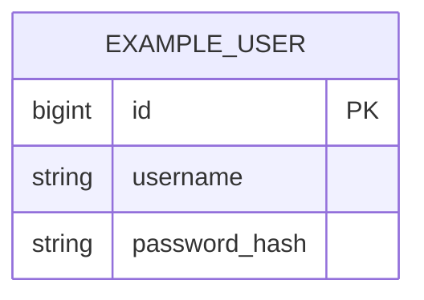

# 06 — Data Model (Modelo de datos)

> Objetivo: describir el modelo Postgres (tablas clave + constraints + índices) y cómo versionamos scripts.

## 1) Convenciones de scripts SQL (sin migrador)
- Ubicación: `<carpeta scripts>`
- Naming sugerido:
  - `YYYYMMDD_<issueId>_<descripcion>.sql`
  - `YYYYMMDD_<issueId>_<descripcion>__rollback.sql`
- Cada cambio DB debe incluir:
  - Script incremental
  - Rollback manual (best-effort)

## 2) Tablas principales
- `<tabla>`:
  - PK:
  - Campos:
  - FKs:
  - Índices:
  - Constraints:

## 3) ERD (Mermaid) — opcional pero recomendado

## 4) Índices y performance
- Listar índices agregados y motivo (consulta que acelera).
- Evitar over-indexing.
