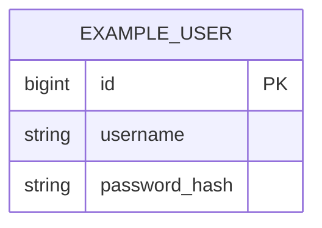

# 06 — Data Model (Modelo de datos)

> Objetivo: describir el modelo Postgres (tablas clave + constraints + índices) y cómo versionamos scripts.

## 1) Convenciones de scripts SQL (sin migrador)
- Ubicación: `<carpeta scripts>`
- Naming sugerido:
  - `YYYYMMDD_<issueId>_<descripcion>.sql`
  - `YYYYMMDD_<issueId>_<descripcion>__rollback.sql`
- Cada cambio DB debe incluir:
  - Script incremental
  - Rollback manual (best-effort)

## 2) Tablas principales

### clientes

Tabla de clientes para asociar a pedidos. Solo campos definidos: nombre/razón social, teléfono, email, dirección principal, tipo (común/abono). Código interno/externo no aplica.

- **PK:** `id` (BIGSERIAL / BIGINT GENERATED BY DEFAULT AS IDENTITY)
- **Campos:**
  - `id` — BIGINT, PK
  - `razon_social` — VARCHAR(255), NOT NULL (nombre o razón social)
  - `telefono` — VARCHAR(50), nullable
  - `email` — VARCHAR(255), nullable
  - `direccion_principal` — VARCHAR(500), nullable
  - `tipo` — VARCHAR(10), NOT NULL, valores: `COMUN` | `ABONO`
  - *(opcional / supuesto)* `created_at` — TIMESTAMPTZ, default now()
  - *(opcional / supuesto)* `updated_at` — TIMESTAMPTZ, default now()
- **FKs:** ninguna (pedidos referenciará clientes cuando exista el recurso pedidos).
- **Índices:**
  - `idx_clientes_razon_social` — búsqueda/listado por nombre
  - `idx_clientes_tipo` — filtro por tipo (común/abono) si se usa
- **Constraints:**
  - `chk_clientes_tipo` — CHECK (tipo IN ('COMUN', 'ABONO'))
  - `razon_social` NOT NULL (validación mínima: no vacío; en app también)

Scripts: incremental `YYYYMMDD_<issueId>_clientes.sql`; rollback manual `YYYYMMDD_<issueId>_clientes__rollback.sql`.

---

- `<tabla>`:
  - PK:
  - Campos:
  - FKs:
  - Índices:
  - Constraints:

## 3) ERD (Mermaid) — opcional pero recomendado

## 4) Índices y performance
- Listar índices agregados y motivo (consulta que acelera).
- Evitar over-indexing.
